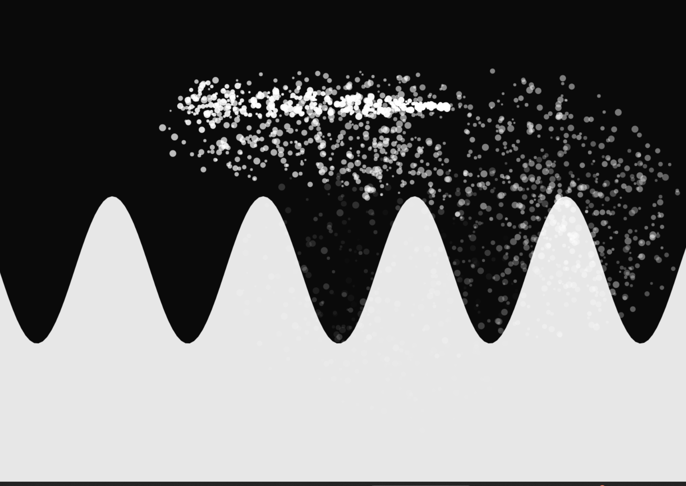

# 🌊 Interactive Wave Experiment (p5.js)

### by Ursula Vallejo Janne

A lightweight interactive sketch created with **p5.js**, designed to run seamlessly on **iOS Safari** and desktop browsers.
The project explores simple visual interactions — combining a soft **wave motion** with **particle bursts** that react to touch or mouse input.

🔗 [Interactive Waves Preview](https://p5-waves-particules-ios-test.netlify.app/)

---

## Concept

This experiment focuses on **gesture-based interaction** and **minimal design**.
It’s meant as a prototype for exploring motion and responsiveness in mobile web environments.

- Touch or click to create particles.
- Works in fullscreen mode with a fixed canvas.
- Optimized for smooth performance on iPhone and iPad.
- Optional support for background images.

---

## Tech Stack

- **p5.js** (core library)
- **p5.sound.js** (included but not used yet — for future sound interaction)
- **HTML / CSS / JavaScript (ES6)**

---

## How to run

1. Clone or download the repository.
2. Open `index.html` in any browser (works offline).
3. For mobile (iOS): use **Add to Home Screen** in Safari for fullscreen mode.

---

🛠️ Built with
p5.js · JavaScript · Creative Coding

## License

© 2025 **Ursula Vallejo Janne**
Released under the [MIT License](./LICENSE).
You are free to explore, remix, and use this work for educational or artistic purposes.
